# Chapter 1: Spring Fundamentals

_Status: In progress — topics being taught one at a time in chat; full notes filled in as each topic is covered._

---

## 📖 Glossary (terms used in this chapter)

Quick-reference definitions. Each links to where it's explained in full.

| Term | Plain-English meaning | Covered in |
|---|---|---|
| **Bean** | Any object that **Spring creates and manages** for you (instead of you writing `new`). A class becomes a bean by carrying `@Component`/`@Service`/`@Repository`/`@Controller`. | [Section 4a](#4a-what-is-a-bean) |
| **Bean Definition** ("recipe") | The **information about** a bean — its name, class, dependencies, scope. Metadata only; **not an object yet**. Spring registers all definitions before creating any objects. | [Section 4b](#4b-bean-definitions-vs-bean-instances-recipes-vs-cooked-dishes) |
| **Container** | The engine (`ApplicationContext`) that stores bean definitions, creates the beans, injects their dependencies, and manages their lifecycle. | [Section 4](#4-spring-container) |
| **IoC** | *Inversion of Control* — the principle that the framework, not your code, controls object creation and wiring. | [Section 2](#2-ioc-inversion-of-control) |
| **DI** | *Dependency Injection* — the technique the container uses to implement IoC: handing dependencies into your objects. | [Section 3](#3-dependency-injection) |
| **Dependency** | Any object your class needs to do its job (e.g. `OrderService` needs a `PaymentGateway`). | [Section 3](#3-dependency-injection) |
| **Decoupled** | A class depends only on an interface, not a concrete class — so implementations can be swapped without editing it. | [Section 1 doubt](#1-what-is-spring-framework-why-spring) |
| **Component scanning** | Spring's startup search through your packages for annotated classes to register as beans. | [Section 3](#how-spring-actually-finds-a-bean-of-the-required-type-internals) |
| **Deepest first** | The creation order: Spring builds the bean with **no dependencies of its own** first, then works back up the chain. | [Section 4c](#4c-creation-order-deepest-first) |
| **Singleton** | Spring creates **one shared instance** and gives that same object to everyone who needs it. This is the default scope. | [Section 6](#singleton--the-default) |
| **Scope** | How many instances of a bean Spring creates and how long each lives. | [Section 6](#6-bean-scopes) |
| **Prototype** | A **new instance** is created every time the bean is requested. | [Section 6](#prototype) |
| **State / Stateful** | Data held in a field that **changes** while the app runs. | [Section 6](#️-the-biggest-singleton-pitfall--shared-mutable-state) |
| **Stateless** | A class holding no changing data — only behavior plus fixed dependencies. Safe to share across users/threads. | [Section 6](#️-the-biggest-singleton-pitfall--shared-mutable-state) |
| **Mutable** | Changeable after creation (opposite: *immutable*). | [Section 6](#️-the-biggest-singleton-pitfall--shared-mutable-state) |
| **HTTP request** | One single call from a client to your server; starts on arrival, ends when the response is sent. | [Section 6](#the-scopes) |
| **Session** | A series of requests from the same user over time (login → logout). | [Section 6](#the-scopes) |
| **Eager** | Bean is created at startup even if nothing has used it yet — Spring's default. | Topic 10 (Lazy Init) |
| **Lazy** | Bean is created only the first time something actually asks for it. | Topic 10 (Lazy Init) |
| **Fail-fast** | Wiring errors crash the app **at startup** rather than surfacing later mid-request. | [Section 3](#how-spring-resolves-what-to-inject--by-type-first) |
| **Lifecycle** | The sequence of stages a bean passes through, from creation to destruction. | [Section 5](#5-bean-lifecycle) |
| **Hook / Callback** | A method *you* write that *Spring* calls automatically at a specific moment (you never call it yourself). | [Section 5](#5-bean-lifecycle) |
| **Graceful shutdown** | App is asked politely to stop (`Ctrl+C`, `SIGTERM`) and gets time to clean up — as opposed to being force-killed. | [Section 5](#two-important-gotchas) |

---

## 1. What is Spring Framework? Why Spring?

Plain Java forces you to manually `new` up every object and wire dependencies by hand.

**Spring's core idea**: you write plain Java classes, and Spring's container creates them, wires them together, and manages their lifecycle.

```java
// Plain Java — OrderService creates its own dependency
public class OrderService {
    private PaymentGateway gateway = new RazorpayGateway();
}

// Spring way — OrderService just declares what it needs
@Service // <-- the one Spring-specific line: "Spring, please manage and construct this"
public class OrderService {
    private final PaymentGateway gateway;

    public OrderService(PaymentGateway gateway) { // Spring calls this for you
        this.gateway = gateway;
    }
}
```
Business classes stay plain Java. Spring's role = the `@Service` annotation that opts the class in, plus the container running behind the scenes that does the `new` and wiring you'd otherwise write by hand.

**Without Spring vs With Spring:**

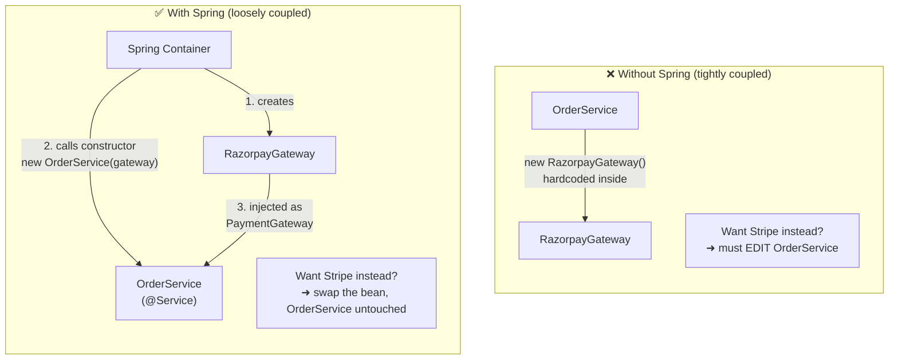

**Interview line**: *"Spring is built around Inversion of Control — it manages object creation and wiring so business classes stay decoupled."*

> 🔴 **Doubt (asked during this chapter): "This constructor code is plain Java too — how does Spring relate to it?"**
>
> Answer: The constructor itself is plain Java — Spring's involvement is (1) the `@Service` annotation marking the class as Spring-managed, and (2) the container calling `new OrderService(...)` for you at startup instead of you writing that line yourself.

> 🔴 **Doubt (asked during this chapter): "How does Spring know which constructor to call — parameterless or parameterized?"**
>
> Answer: Spring inspects the class via reflection at startup.
> - **Only one constructor exists** → Spring uses it automatically, no annotation needed.
> - **Multiple constructors exist** → Spring can't guess which to use, so mark the intended one with `@Autowired`. Without it, Spring falls back to the no-arg constructor and any dependency fields stay `null`.
>
> ```java
> @Service
> public class OrderService {
>     private PaymentGateway gateway;
>
>     public OrderService() { } // constructor A
>
>     @Autowired
>     public OrderService(PaymentGateway gateway) { // constructor B — Spring uses this one
>         this.gateway = gateway;
>     }
> }
> ```
>
> `@Autowired` placement rule: it goes directly above whichever thing you're marking — constructor, field, or setter:
> ```java
> @Autowired
> private PaymentGateway gateway;                          // field injection
>
> @Autowired
> public void setGateway(PaymentGateway gateway) { ... }    // setter injection
> ```
> (Injection types covered properly in Topic 8.)

> 🔴 **Doubt (asked during this chapter): "What is 'decoupled'?"**
>
> Answer: Decoupled = a class doesn't depend on another class's concrete details, only on what it needs (usually an interface). Change one, the other doesn't break.
>
> - **Coupled (bad)**: `OrderService` hardcodes `new RazorpayGateway()` — tightly tied to that one class; switching gateways means editing `OrderService`.
> - **Decoupled (good)**: `OrderService` only takes a `PaymentGateway` via its constructor — it doesn't care which implementation it gets, so `StripeGateway` can be swapped in with zero changes to `OrderService`.
>
> ```mermaid
> flowchart LR
>     subgraph C["Coupled"]
>         C1[OrderService] -->|depends on<br/>CONCRETE class| C2[RazorpayGateway]
>     end
>     subgraph D["Decoupled"]
>         D1[OrderService] -->|depends on<br/>INTERFACE| D2["PaymentGateway<br/>«interface»"]
>         D3[RazorpayGateway] -.implements.-> D2
>         D4[StripeGateway] -.implements.-> D2
>     end
> ```

---

## 2. IoC (Inversion of Control)

**Normal control flow**: your code decides when to create objects and calls the shots.
```java
PaymentGateway gateway = new RazorpayGateway(); // you're in control
OrderService service = new OrderService(gateway);
```

**Inverted control**: you hand that responsibility to a framework. You just declare "I need a `PaymentGateway`" and the **Spring IoC Container** decides what to create and when, then hands it to you.

Sometimes called the **"Hollywood Principle": "Don't call us, we'll call you."** You don't call `new` to get your dependencies — the container calls your constructor and gives them to you.

**Direction of control — who calls whom:**

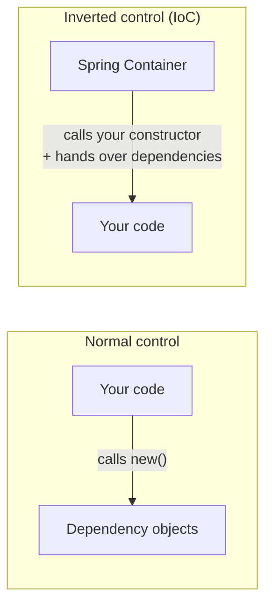
The arrow flips — that flip *is* the "inversion."

**How the three terms relate:**

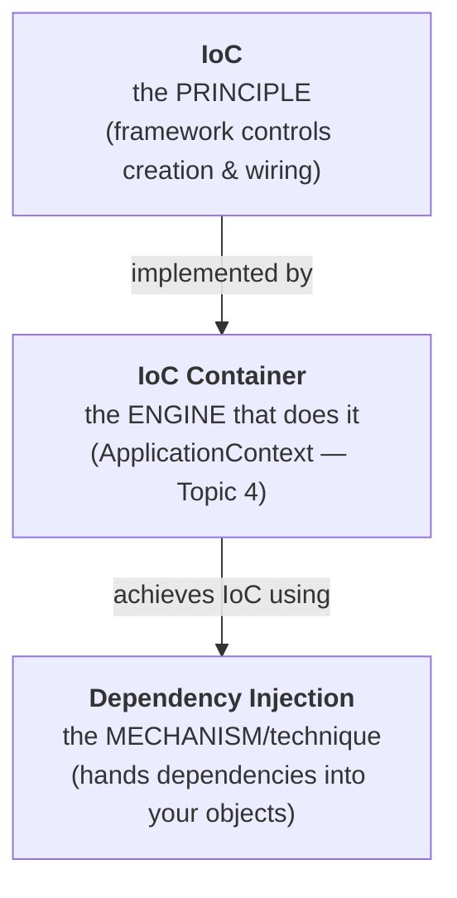

**Key terms:**
- **IoC** = the *principle* — control is inverted, framework manages object creation/wiring instead of your code.
- **IoC Container** = the actual engine in Spring that does this (named properly — `ApplicationContext` — in Topic 4).
- **Dependency Injection (DI)** = the *mechanism* the container uses to implement IoC (handing dependencies to your objects, mainly via constructors).

So: **IoC is the "what/why," DI is the "how."**

**Interview line**: *"IoC means the framework controls object creation and wiring instead of your code doing it manually. DI is the specific technique Spring uses to achieve that — injecting dependencies into your objects rather than having them create their own."*

---

## 3. Dependency Injection

**Dependency** = any object your class needs to do its job. `OrderService` needs a `PaymentGateway` → that's its dependency.

**Injection** = that object being *handed to you from outside*, instead of you creating it.

### Complete working example

```java
// ── 1. The interface (the "contract") ──────────────────────────────
package com.example.myproject2.payment;

public interface PaymentGateway {
    String pay(double amount);
}
```

```java
// ── 2. The implementation — becomes a Spring bean via @Service ──────
package com.example.myproject2.payment;

import org.springframework.stereotype.Service;

@Service   // registers this class in the container as bean "razorpayGateway"
public class RazorpayGateway implements PaymentGateway {
    @Override
    public String pay(double amount) {
        return "Paid " + amount + " via Razorpay";
    }
}
```

```java
// ── 3. The consumer — declares its dependency, never creates it ─────
package com.example.myproject2.service;

import com.example.myproject2.payment.PaymentGateway;
import org.springframework.stereotype.Service;

@Service
public class OrderService {

    private final PaymentGateway gateway;   // final = can never be reassigned

    // Only ONE constructor → Spring uses it automatically, no @Autowired needed.
    // Spring sees the parameter type PaymentGateway, finds RazorpayGateway
    // in the registry, creates it, and passes it in here.
    public OrderService(PaymentGateway gateway) {
        this.gateway = gateway;
    }

    public String placeOrder(double amount) {
        return gateway.pay(amount);   // OrderService has no idea it's Razorpay
    }
}
```

```java
// ── 4. Using it — controller also gets its dependency injected ──────
package com.example.myproject2.controller;

import com.example.myproject2.service.OrderService;
import org.springframework.web.bind.annotation.*;

@RestController
public class OrderController {

    private final OrderService orderService;

    public OrderController(OrderService orderService) {  // injected by Spring
        this.orderService = orderService;
    }

    @GetMapping("/order/{amount}")
    public String order(@PathVariable double amount) {
        return orderService.placeOrder(amount);
    }
}
```

Notice: **nowhere in this codebase is there a single `new` call.** Spring builds the entire chain — `RazorpayGateway` → `OrderService` → `OrderController` — in dependency order at startup.

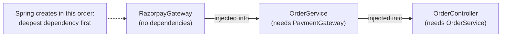

### How Spring resolves what to inject — by TYPE first

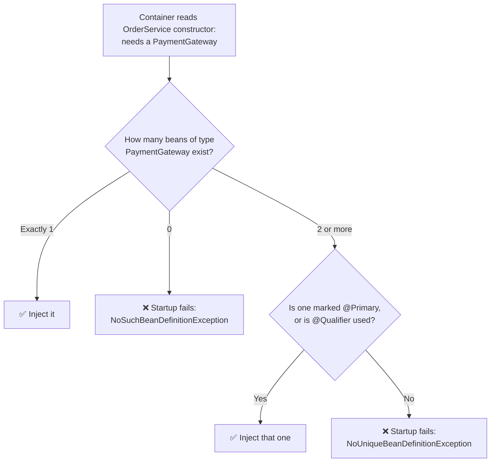

Two key takeaways from that flow:

1. **Spring matches by type, not by variable name.** The parameter could be named `gateway`, `pg`, or `xyz` — Spring only cares that its type is `PaymentGateway`.
2. **Errors surface at startup, not at runtime.** Broken wiring means the app refuses to boot instead of blowing up mid-request later. This is **fail-fast**, and it's a major practical benefit.

### The full DI flow at app startup

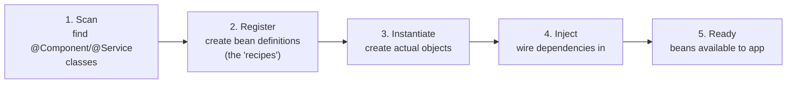

> The two failure cases above (`NoSuchBeanDefinitionException` / `NoUniqueBeanDefinitionException`) are solved with `@Primary` and `@Qualifier` — covered in Topic 9.

### How Spring actually FINDS a bean of the required type (internals)

Two stages: **component scanning** (finding candidates) then **registry type-matching** (picking one).

**Stage 1 — Component scanning.** `@SpringBootApplication` on your main class is itself meta-annotated with `@ComponentScan`, which tells Spring: *"scan my own package and every sub-package below it."* Every class found carrying `@Component` or one of its specializations (`@Service`, `@Repository`, `@Controller`, `@RestController`) becomes a candidate.

**Stage 2 — Bean Definition Registry.** Each candidate is registered as a **bean definition** — a "recipe" record holding the bean's name, its class type, scope, and dependencies. Note: at this stage no objects exist yet, only definitions. When Spring later needs a `PaymentGateway`, it queries the registry: *"which registered bean types are **assignable** to `PaymentGateway`?"* — i.e. any class implementing or extending it.

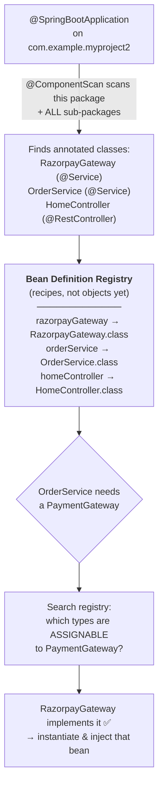

**Default bean name** = class name with a lowercase first letter (`RazorpayGateway` → `razorpayGateway`), unless you override it: `@Service("customName")`.

> ⚠️ **Common beginner bug**: classes placed **outside** your main application class's package are **never scanned**, so they never become beans — you'll hit `NoSuchBeanDefinitionException` or a `null` dependency. Keep all your code under the main class's package (`com.example.myproject2`) or below it.

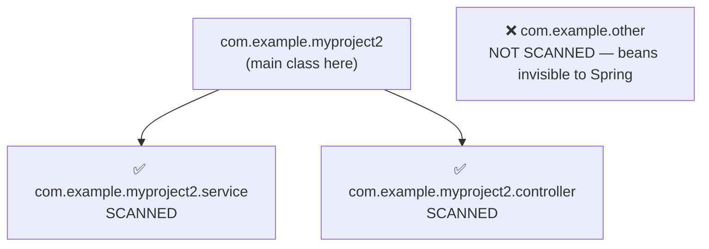

**Interview line**: *"DI is the technique where the container supplies a class's dependencies from outside rather than the class constructing them. Spring component-scans the main class's package downward, registers bean definitions, then resolves each dependency by type — failing fast at startup if a match is missing or ambiguous."*

> 🔴 **Doubt (asked during this chapter): "Is it because `RazorpayGateway` implements `PaymentGateway` that Spring knew to pass it into the `OrderService` constructor?"**
>
> Answer: Yes — but **two conditions must both be true**:
>
> 1. **It implements the interface** → `RazorpayGateway implements PaymentGateway`, so it's type-compatible.
> 2. **It is registered as a bean** → it carries `@Service` (or another `@Component` specialization), so component scanning picked it up.
>
> Implementing the interface alone is NOT enough. Without the annotation Spring never scans the class, doesn't know it exists, and startup fails with `NoSuchBeanDefinitionException`:
>
> ```java
> // ❌ implements the interface, but invisible to Spring
> public class RazorpayGateway implements PaymentGateway { ... }
>
> // ✅ implements the interface AND is registered as a bean
> @Service
> public class RazorpayGateway implements PaymentGateway { ... }
> ```
>
> ```mermaid
> flowchart TD
>     A["OrderService constructor asks for:<br/>PaymentGateway"] --> B{"Search registered beans"}
>     B --> C["RazorpayGateway<br/>✅ has @Service (registered)<br/>✅ implements PaymentGateway"]
>     C --> D["Both true → INJECT IT"]
>     B --> E["SomeOtherClass<br/>❌ doesn't implement PaymentGateway"]
>     E --> F["Skipped"]
>     B --> G["StripeGateway<br/>✅ implements PaymentGateway<br/>❌ no @Service annotation"]
>     G --> H["Invisible to Spring → skipped"]
> ```
>
> **Important catch**: this resolves cleanly only because there is **exactly one** registered implementation. Add a second one and Spring can no longer decide:
>
> ```java
> @Service public class RazorpayGateway implements PaymentGateway { ... }
> @Service public class StripeGateway  implements PaymentGateway { ... }  // 2 candidates
> ```
> → startup fails with `NoUniqueBeanDefinitionException`. This is exactly what `@Primary` and `@Qualifier` solve (Topic 9).

---

## 4. Spring Container

The **container** is the engine that does all the IoC/DI work. It's an actual object living in memory for your application's entire lifetime.

### 4a. What is a "Bean"?

**A bean is simply an object that Spring creates and manages for you.** That is the entire definition.

The difference is *who* creates the object:

```java
// ❌ NOT a bean — you created it, Spring knows nothing about it
OrderService service = new OrderService();

// ✅ A BEAN — Spring created it (because of @Service) and manages it
@Service
public class OrderService { }
```

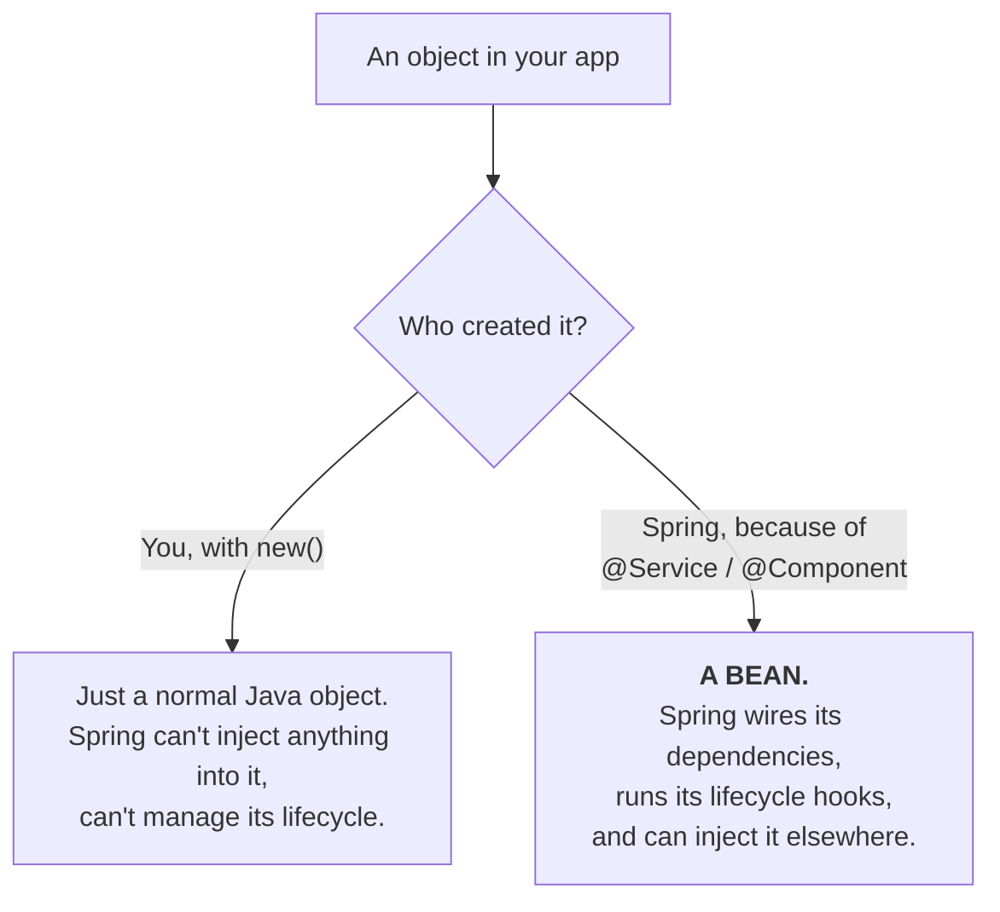

So "Spring creates the beans at startup" simply means "Spring creates the objects for all your `@Service`/`@Component`/`@Repository`/`@Controller` classes."

> The word "bean" is a leftover from an old Java convention called *JavaBeans*. The name carries no useful meaning today — read it as **"Spring-managed object."**

### 4b. Bean Definitions vs Bean Instances (recipes vs cooked dishes)

Spring's startup runs in **two separate phases** — a common beginner confusion point.

**Phase 1 — Registration.** Spring scans your code and writes down *information about* each class: name, type, required dependencies, scope. This written-down information is a **bean definition**. It is **not** an object — it's metadata describing how to build one later.

**Phase 2 — Instantiation.** Spring reads those definitions and actually calls the constructors, creating real objects in memory. Those objects are the **beans**.

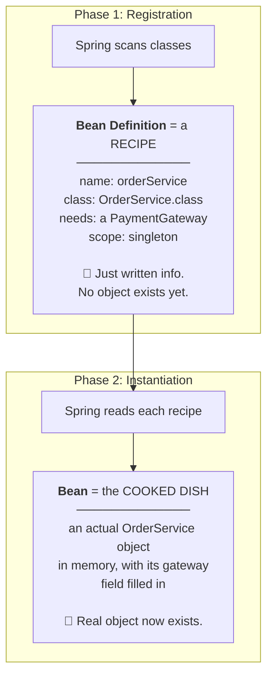

**Why two phases?** Spring must know about *all* classes before creating *any* of them. If it instantiated `OrderService` the instant it found it, `RazorpayGateway` might not have been discovered yet, and wiring would fail. Reading all the recipes first gives Spring the complete picture before it starts "cooking."

### 4c. Creation order — "deepest first"

This is the **order** in which Spring creates objects when beans depend on each other.

Our chain: `OrderController` needs `OrderService`, which needs `RazorpayGateway`, which needs nothing.

Spring **cannot** create `OrderController` first — its constructor demands a finished `OrderService` that doesn't exist yet. So Spring starts with whatever needs nothing and builds up.

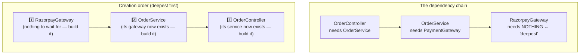

**"Deepest"** = the bean furthest down the chain, the one with no dependencies of its own. Spring starts there and works back up. Like building a house: foundation → walls → roof. You can't start with the roof.

### What the container actually holds

Three responsibilities in one object:

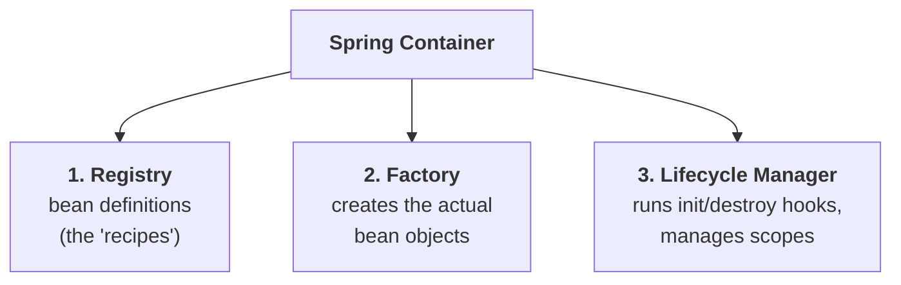

### BeanFactory vs ApplicationContext

| | `BeanFactory` | `ApplicationContext` |
|---|---|---|
| Role | Root/basic container interface | Extends `BeanFactory`, adds enterprise features |
| Bean loading | **Lazy** — creates a bean only when requested | **Eager** — creates all singletons at startup |
| Extra features | None | Event publishing, i18n, AOP integration, annotation config, resource loading |
| Used today? | Almost never directly | **Yes — this is what Spring Boot uses** |

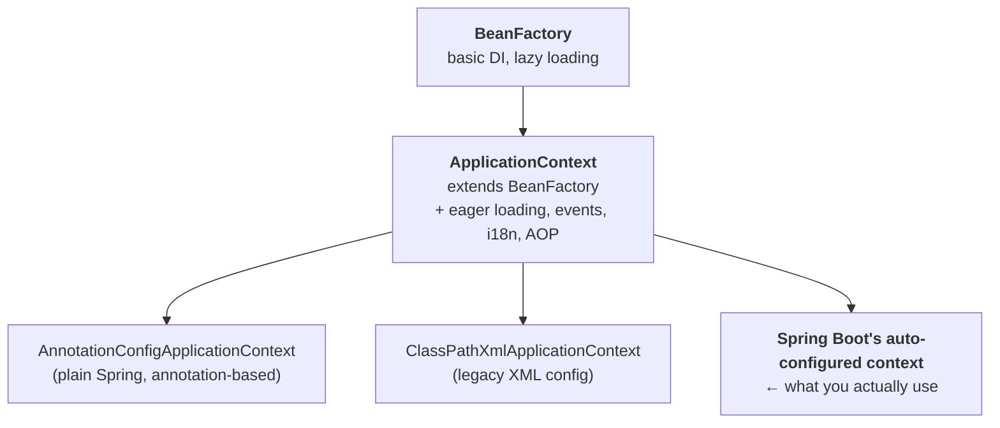

**Rule of thumb**: `ApplicationContext` *is* `BeanFactory` plus extras. When someone says "the Spring container," they mean `ApplicationContext`.

### Where the container is created in your project

One line does it — in `MyProject2Application.java`:

```java
@SpringBootApplication
public class MyProject2Application {
    public static void main(String[] args) {
        SpringApplication.run(MyProject2Application.class, args);
        //  ↑ this single line: creates the ApplicationContext, scans packages,
        //    registers bean definitions, instantiates beans, injects dependencies,
        //    starts embedded Tomcat — all before your app is "up"
    }
}
```

`run()` also **returns** the container if you need a handle on it:
```java
ApplicationContext context = SpringApplication.run(MyProject2Application.class, args);
```

**Source reference**: `c:\Users\Asus\Downloads\demo\myProject2\src\main\java\com\example\myproject2\MyProject2Application.java`

### Startup sequence inside `run()`

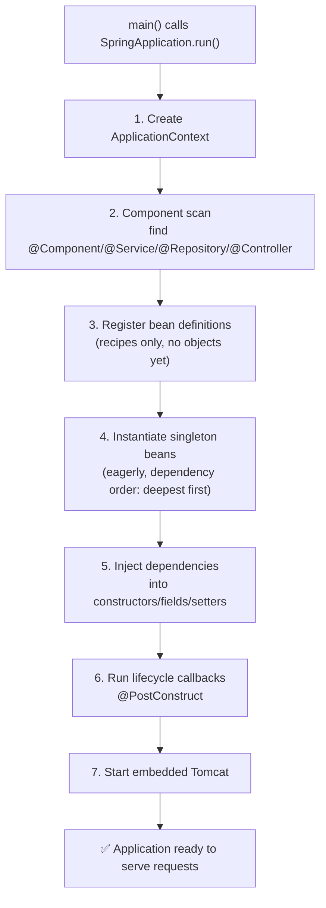

### Getting a bean manually — and why you usually shouldn't

```java
ApplicationContext context = SpringApplication.run(MyProject2Application.class, args);

OrderService service = context.getBean(OrderService.class);                   // by type
OrderService s2      = context.getBean("orderService", OrderService.class);   // by name + type
```

> ⚠️ **Pitfall**: calling `getBean()` inside your business classes defeats the purpose of DI — you're *pulling* dependencies instead of having them *pushed* to you, which re-couples your class to Spring itself. Use constructor injection. `getBean()` is for rare framework-level code or quick experiments in `main()`.

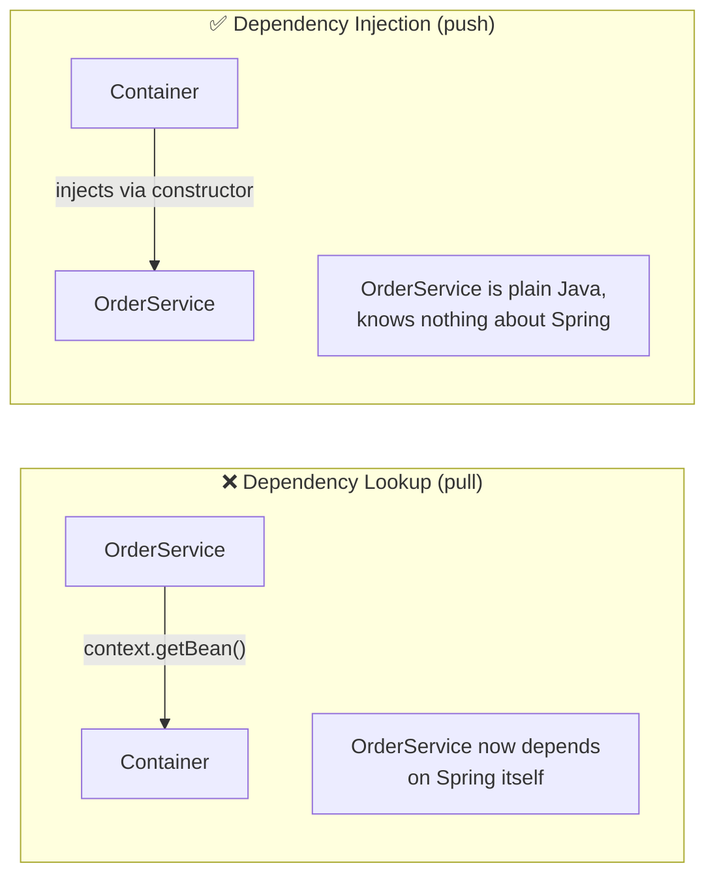

**Interview line**: *"The Spring container is the `ApplicationContext` — it holds bean definitions, creates and wires the bean instances, and manages their lifecycle. `ApplicationContext` extends `BeanFactory`, adding eager singleton loading, event publishing, and AOP support. In Spring Boot it's created by `SpringApplication.run()`."*

---

## 5. Bean Lifecycle

**"Lifecycle"** = the complete sequence of stages a bean goes through, from the moment Spring creates it until it's destroyed at app shutdown.

**Why it matters**: sometimes you need code to run **right after** a bean is ready (load a cache, open a connection, validate config), or **right before** it dies (close a connection, flush data). The lifecycle gives you exact hook points for this.

**"Hook" / "callback"** = a method *you* write that *Spring* calls automatically at a specific moment. You never call it yourself — Spring "calls back" into your code at the right time.

### The full lifecycle

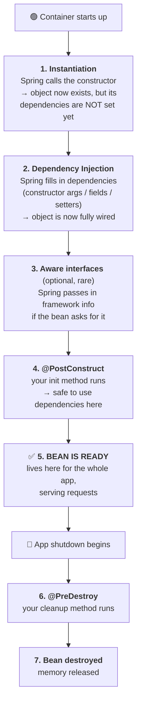

### The two hooks you'll actually use

```java
package com.example.myproject2.service;

import jakarta.annotation.PostConstruct;   // Spring Boot 3+ uses jakarta.*
import jakarta.annotation.PreDestroy;      // (older Spring used javax.*)
import org.springframework.stereotype.Service;

@Service
public class OrderService {

    private final PaymentGateway gateway;

    // ── STAGE 1: constructor runs first ──
    public OrderService(PaymentGateway gateway) {
        this.gateway = gateway;
        System.out.println("1. Constructor called - dependencies injected");
    }

    // ── STAGE 4: runs ONCE, after injection, before the bean serves anyone ──
    @PostConstruct
    public void init() {
        System.out.println("2. @PostConstruct - bean fully ready, safe to use gateway");
        // typical real uses: warm up a cache, open a connection,
        // validate that required config values are present
    }

    // ── STAGE 6: runs ONCE, at app shutdown, before the bean is destroyed ──
    @PreDestroy
    public void cleanup() {
        System.out.println("3. @PreDestroy - releasing resources before shutdown");
        // typical real uses: close connections, flush buffers,
        // deregister from a service registry
    }
}
```

**Console output when you run the app:**
```
1. Constructor called - dependencies injected
2. @PostConstruct - bean fully ready, safe to use gateway
   ... app runs, serves requests ...
3. @PreDestroy - releasing resources before shutdown
```

### Why `@PostConstruct` exists — the constructor trap

A common interview probe: why not just put init logic in the constructor?

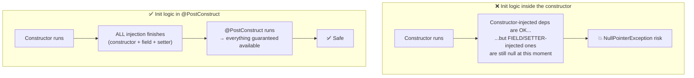

**In one line**: the constructor runs *during* wiring; `@PostConstruct` runs *after all wiring is complete*. Anything depending on the bean being fully assembled belongs in `@PostConstruct`.

### The older way (recognize in legacy code, don't write it)

Before annotations, Spring used **interfaces** — you implemented a Spring interface and overrode its method:

```java
// ❌ Legacy style — couples YOUR class to Spring's interfaces
@Service
public class OrderService implements InitializingBean, DisposableBean {

    @Override
    public void afterPropertiesSet() {   // equivalent to @PostConstruct
        System.out.println("init logic");
    }

    @Override
    public void destroy() {              // equivalent to @PreDestroy
        System.out.println("cleanup logic");
    }
}
```

| Approach | Init | Destroy | Verdict |
|---|---|---|---|
| **Annotations** | `@PostConstruct` | `@PreDestroy` | ✅ Use this — your class stays plain Java |
| Interfaces | `InitializingBean.afterPropertiesSet()` | `DisposableBean.destroy()` | ❌ Legacy — ties your class to Spring |
| `@Bean` attributes | `@Bean(initMethod="...")` | `@Bean(destroyMethod="...")` | For third-party classes you can't annotate |

### Two important gotchas

> ⚠️ **`@PreDestroy` only runs on a graceful shutdown.** *Graceful* = the app is asked politely to stop (`Ctrl+C`, `SIGTERM`, container stop) and is given time to clean up. If the process is force-killed (`kill -9`, power loss, crash), `@PreDestroy` **never runs**. Never rely on it for critical data-saving.

> ⚠️ **`@PreDestroy` does not run for prototype-scoped beans.** Spring hands you a prototype bean and then forgets about it — it doesn't track it, so it can't destroy it. Only singleton beans get destroy callbacks. (**Scopes → Topic 6.**)

**Interview line**: *"The bean lifecycle is: instantiate → inject dependencies → `@PostConstruct` → bean in use → `@PreDestroy` → destroy. `@PostConstruct` is preferred over constructor logic because it runs after **all** injection completes, and preferred over `InitializingBean` because it keeps your class free of Spring interfaces."*

---

## 6. Bean Scopes

**"Scope"** = the answer to two questions: **how many instances** of this bean does Spring create, and **how long does each one live**?

> 🔴 **Doubt (asked during this chapter): "You said an object is called a bean in Spring — but now you say 'how many instances of this bean'. Isn't an instance also an object?"**
>
> Answer: Yes, **"instance" and "object" mean the same thing** in Java (`new OrderService()` creates an instance = creates an object). The confusion comes from the word **"bean" being used loosely for two different things**. Three distinct levels:
>
> | Level | What it is | Exists where |
> |---|---|---|
> | **Class** | Your written code — the blueprint | In your `.java` file |
> | **Bean definition** | Spring's registered recipe for that class (Section 4b) | In the container's registry, as metadata |
> | **Bean instance** (= bean = object) | The actual live object | In memory (heap) |
>
> ```mermaid
> flowchart TD
>     A["<b>class OrderService</b><br/>your code — the blueprint<br/>(exists once, in a file)"] --> B["<b>Bean Definition</b><br/>Spring's recipe:<br/>'orderService → OrderService.class,<br/>scope: singleton'<br/>(exists once, in the registry)"]
>     B -->|"scope decides<br/>HOW MANY to create"| C["<b>Bean Instances</b> (= objects)<br/>the real things in memory"]
>     C --> D["singleton → 1 object"]
>     C --> E["prototype → many objects<br/>obj#1, obj#2, obj#3..."]
> ```
>
> So "how many instances of this bean" precisely means: **"from this one bean definition, how many objects does Spring create?"**
> - **singleton** → 1 definition → **1 object**, shared by all
> - **prototype** → 1 definition → **many objects**, one per request
>
> **Why the ambiguity exists**: Spring developers say "bean" for both the definition and the instance, depending on context. It's genuinely sloppy terminology that everyone uses. When unclear, ask yourself *"definition or object?"*:
> - *"Spring registered 12 beans"* → 12 **definitions**
> - *"inject the OrderService bean"* → the **object**
> - *"prototype beans aren't destroyed"* → the **objects**

### The scopes

| Scope | How many instances | Lifetime | Availability |
|---|---|---|---|
| **`singleton`** (default) | **One**, shared by everyone | Entire app lifetime | Always |
| **`prototype`** | **A new one** every time it's requested | Until garbage-collected | Always |
| **`request`** | One per HTTP request | That one request | Web apps only |
| **`session`** | One per user session | Until session expires/logout | Web apps only |
| `application` | One per ServletContext | App lifetime | Web apps only (rare) |
| `websocket` | One per WebSocket session | That connection | Web apps only (rare) |

**Terms used above:**
- **HTTP request** = one single call from a browser/client to your server (e.g. one `GET /order/500`). Starts when the call arrives, ends when your response is sent.
- **Session** = a series of requests from the *same user* over time (e.g. login → logout). The server remembers who they are between requests.
- **ServletContext** = the whole running web application, shared by all users. (Servlets → Chapter 2.)

### Singleton — the default

```java
@Service   // no @Scope written = singleton
public class OrderService { }
```

Every class needing an `OrderService` receives **the exact same object**:

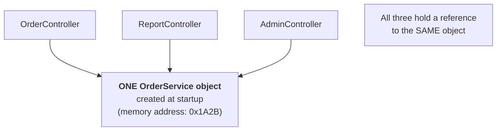

**Why is one shared instance safe?** A typical service bean holds **no changing data** — only behavior (methods) plus injected dependencies that never change after startup. A class with no changing data is **stateless**, and stateless objects are safe to share.

### ⚠️ The biggest singleton pitfall — shared mutable state

**"State"** = data stored in a field that changes while the app runs. **"Mutable"** = changeable.

```java
// ❌ DANGEROUS — this field is shared across every user, every request
@Service
public class OrderService {

    private double lastAmount;      // ← STATE. One field, shared by everyone.

    public String placeOrder(double amount) {
        this.lastAmount = amount;   // User A writes 500...
        // ...User B's request writes 999 here at the same moment...
        return "Charged " + this.lastAmount;   // User A now sees 999! 💥
    }
}
```

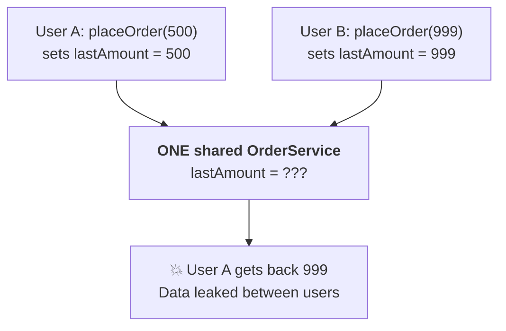

**The fix — keep beans stateless.** Use local variables (each method call gets its own copy) or method parameters instead of fields:

```java
// ✅ SAFE — no shared field; each call has its own local variable
@Service
public class OrderService {
    public String placeOrder(double amount) {
        double total = amount * 1.18;   // local variable, per-call, not shared
        return "Charged " + total;
    }
}
```

**Rule to memorize**: *singleton beans must be stateless.* Injected dependencies held in `final` fields are fine (they never change). Fields reassigned during requests are the danger.

### Prototype

```java
@Service
@Scope("prototype")
public class ReportGenerator {
    private List<String> rows = new ArrayList<>();   // state is OK here —
    // each caller gets their own fresh object, so nothing is shared
}
```

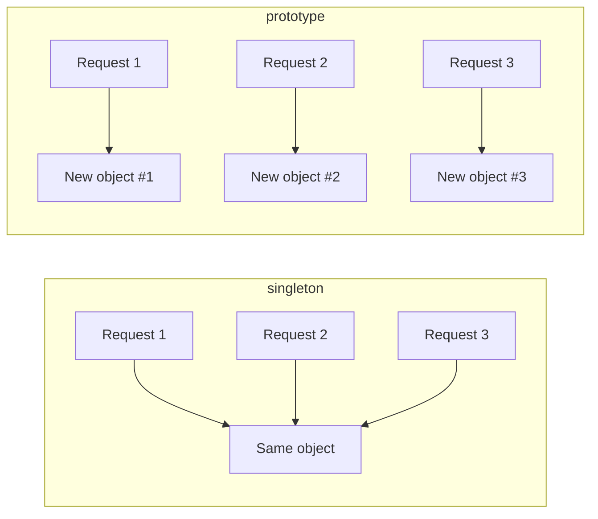

Use prototype when a bean **holds per-use data** and must not be shared — e.g. a builder, or a report accumulating rows.

### ⚠️ The prototype trap (classic interview question)

**Both files matter here — the scope is declared on `ReportGenerator`, not on `OrderService`:**

```java
// ══ FILE 1: ReportGenerator.java ══
// THIS is where "prototype" is declared
@Service
@Scope("prototype")          // ← the ONLY place the scope is set
public class ReportGenerator {
    private List<String> rows = new ArrayList<>();
}
```

```java
// ══ FILE 2: OrderService.java ══
@Service                     // ← no @Scope written = singleton (the default)
public class OrderService {

    private final ReportGenerator generator;

    public OrderService(ReportGenerator generator) {
        this.generator = generator;   // injected ONCE, at startup
    }
}
```

> 🔴 **Doubt (asked during this chapter): "How do I identify that `ReportGenerator` is a prototype bean?"**
>
> Answer: There is only one way — **open that class's file and look for a `@Scope` annotation above the class declaration.** The scope is never visible at the injection site.
>
> ```mermaid
> flowchart TD
>     A["Want to know a bean's scope?"] --> B["Open THAT class's file"]
>     B --> C{"Is there a @Scope annotation<br/>above the class?"}
>     C -->|"@Scope('prototype')"| D["prototype → new object each time"]
>     C -->|"@Scope('request')"| E["request → one per HTTP request"]
>     C -->|"No @Scope at all"| F["singleton → one shared object<br/>(the default)"]
> ```
>
> **This is exactly why the trap is dangerous.** Looking at `OrderService` alone:
> ```java
> public OrderService(ReportGenerator generator) {   // looks completely normal
> ```
> Nothing hints that `ReportGenerator` is a prototype — the code reads identically for singleton or prototype dependencies. A developer writes this expecting fresh instances and silently gets one instance reused forever, with **no error and no startup warning**.
>
> ```mermaid
> flowchart LR
>     A["OrderService.java<br/>─────────<br/>'give me a ReportGenerator'<br/><br/>❓ scope invisible here"] -.->|"must open the other file<br/>to learn the truth"| B["ReportGenerator.java<br/>─────────<br/>@Scope('prototype')<br/><br/>✅ scope declared here"]
> ```
>
> **Practical takeaway**: whenever you mark a class `@Scope("prototype")`, immediately check every place it's injected — if any consumer is a singleton, that consumer needs `ObjectProvider` instead of direct injection.

**Expectation**: a fresh `ReportGenerator` on every use.
**Reality**: `OrderService` is a singleton, so its constructor runs **once**, so `generator` is injected **once**. That same prototype instance is reused forever — the prototype scope is effectively dead.

```mermaid
flowchart TD
    A["OrderService (singleton)<br/>constructor runs ONCE at startup"] --> B["Spring creates ONE ReportGenerator<br/>and injects it"]
    B --> C["❌ That same instance is reused<br/>for every request, forever.<br/>Prototype scope had no effect."]
```

**Fix — ask the container for a fresh instance each time via `ObjectProvider`:**

```java
@Service
public class OrderService {

    private final ObjectProvider<ReportGenerator> generatorProvider;

    public OrderService(ObjectProvider<ReportGenerator> generatorProvider) {
        this.generatorProvider = generatorProvider;
    }

    public void run() {
        ReportGenerator fresh = generatorProvider.getObject();  // NEW instance every call ✅
    }
}
```

### ⚠️ Prototype beans get no destroy callback

Spring creates a prototype bean, hands it over, and then **forgets it exists** — it keeps no reference to it. So it cannot call `@PreDestroy` (Topic 5). Cleanup of prototype beans is your responsibility.

### Two more things interviewers ask

**1. Spring singleton ≠ the Java Singleton design pattern.**

| | Java Singleton pattern | Spring singleton scope |
|---|---|---|
| Scope of uniqueness | One instance per **JVM** (private constructor + static `getInstance()`) | One instance per **Spring container** |
| Enforced by | Your own code | The container |
| Multiple instances possible? | No | **Yes** — two containers in one JVM = two instances |

**2. `request` and `session` scopes are rare today.** Modern REST APIs are **stateless** — each request carries everything needed (typically a JWT token, Chapter 7). Nothing is stored server-side between requests, so session-scoped beans have largely disappeared from modern codebases.

**Interview line**: *"Singleton is the default — one shared instance per container, so singleton beans must be stateless. Prototype creates a new instance per request, but injecting a prototype into a singleton silently gives you only one instance; use `ObjectProvider` to get a fresh one. Request and session scopes are web-only and rare in stateless REST APIs."*