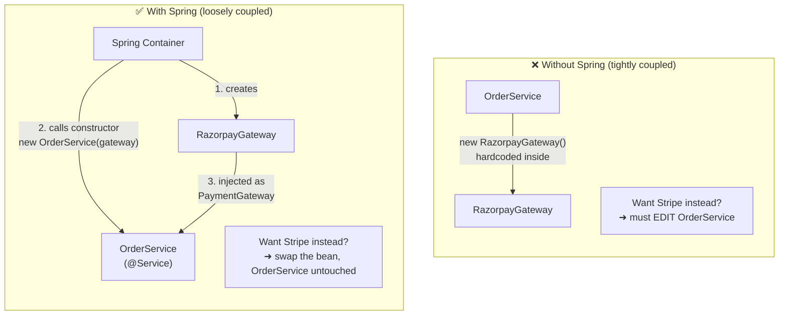
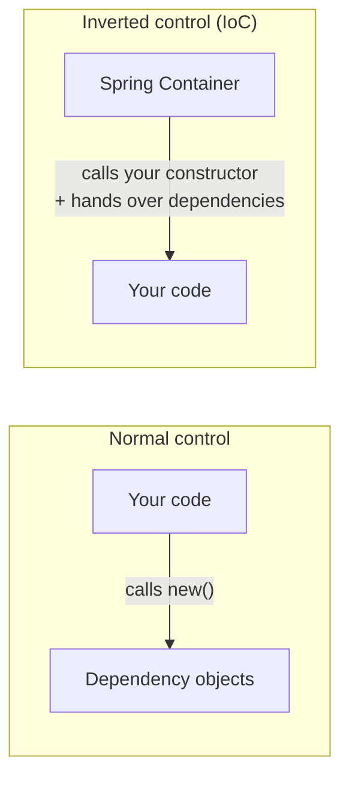
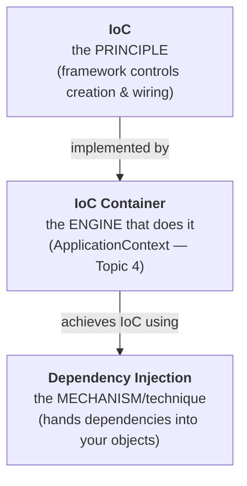
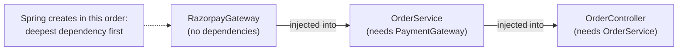
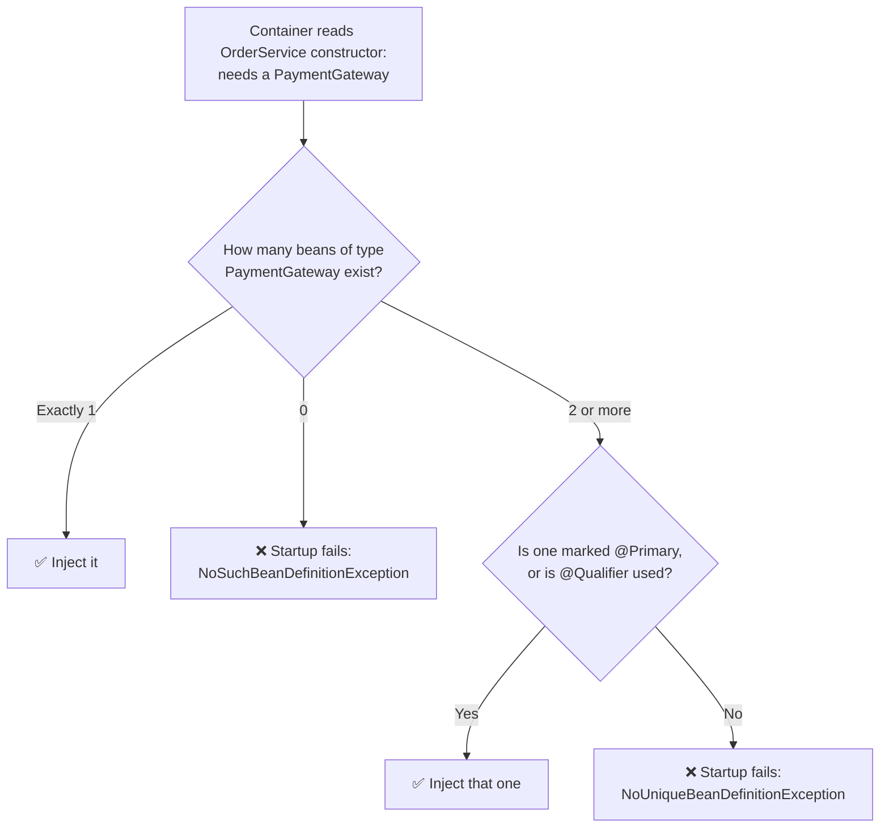
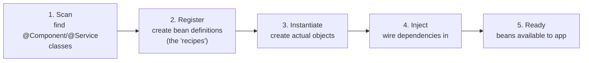
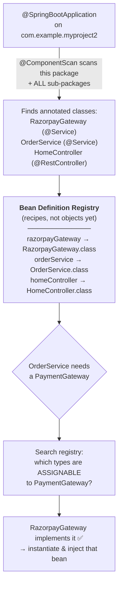
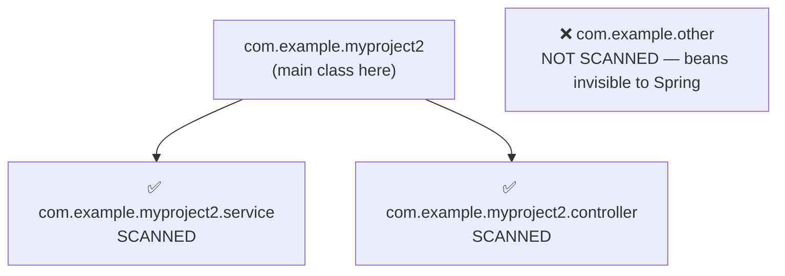

# Chapter 1: Spring Fundamentals

_Status: In progress — topics being taught one at a time in chat; full notes filled in as each topic is covered._

## 1. What is Spring Framework? Why Spring?

Plain Java forces you to manually `new` up every object and wire dependencies by hand.

**Spring's core idea**: you write plain Java classes, and Spring's container creates them, wires them together, and manages their lifecycle.

```java
// Plain Java — OrderService creates its own dependency
public class OrderService {
    private PaymentGateway gateway = new RazorpayGateway();
}

// Spring way — OrderService just declares what it needs
@Service // <-- the one Spring-specific line: "Spring, please manage and construct this"
public class OrderService {
    private final PaymentGateway gateway;

    public OrderService(PaymentGateway gateway) { // Spring calls this for you
        this.gateway = gateway;
    }
}
```
Business classes stay plain Java. Spring's role = the `@Service` annotation that opts the class in, plus the container running behind the scenes that does the `new` and wiring you'd otherwise write by hand.

**Without Spring vs With Spring:**



**Interview line**: *"Spring is built around Inversion of Control — it manages object creation and wiring so business classes stay decoupled."*

> 🔴 **Doubt (asked during this chapter): "This constructor code is plain Java too — how does Spring relate to it?"**
>
> Answer: The constructor itself is plain Java — Spring's involvement is (1) the `@Service` annotation marking the class as Spring-managed, and (2) the container calling `new OrderService(...)` for you at startup instead of you writing that line yourself.

> 🔴 **Doubt (asked during this chapter): "How does Spring know which constructor to call — parameterless or parameterized?"**
>
> Answer: Spring inspects the class via reflection at startup.
> - **Only one constructor exists** → Spring uses it automatically, no annotation needed.
> - **Multiple constructors exist** → Spring can't guess which to use, so mark the intended one with `@Autowired`. Without it, Spring falls back to the no-arg constructor and any dependency fields stay `null`.
>
> ```java
> @Service
> public class OrderService {
>     private PaymentGateway gateway;
>
>     public OrderService() { } // constructor A
>
>     @Autowired
>     public OrderService(PaymentGateway gateway) { // constructor B — Spring uses this one
>         this.gateway = gateway;
>     }
> }
> ```
>
> `@Autowired` placement rule: it goes directly above whichever thing you're marking — constructor, field, or setter:
> ```java
> @Autowired
> private PaymentGateway gateway;                          // field injection
>
> @Autowired
> public void setGateway(PaymentGateway gateway) { ... }    // setter injection
> ```
> (Injection types covered properly in Topic 8.)

> 🔴 **Doubt (asked during this chapter): "What is 'decoupled'?"**
>
> Answer: Decoupled = a class doesn't depend on another class's concrete details, only on what it needs (usually an interface). Change one, the other doesn't break.
>
> - **Coupled (bad)**: `OrderService` hardcodes `new RazorpayGateway()` — tightly tied to that one class; switching gateways means editing `OrderService`.
> - **Decoupled (good)**: `OrderService` only takes a `PaymentGateway` via its constructor — it doesn't care which implementation it gets, so `StripeGateway` can be swapped in with zero changes to `OrderService`.
>
> ```mermaid
> flowchart LR
>     subgraph C["Coupled"]
>         C1[OrderService] -->|depends on<br/>CONCRETE class| C2[RazorpayGateway]
>     end
>     subgraph D["Decoupled"]
>         D1[OrderService] -->|depends on<br/>INTERFACE| D2["PaymentGateway<br/>«interface»"]
>         D3[RazorpayGateway] -.implements.-> D2
>         D4[StripeGateway] -.implements.-> D2
>     end
> ```

---

## 2. IoC (Inversion of Control)

**Normal control flow**: your code decides when to create objects and calls the shots.
```java
PaymentGateway gateway = new RazorpayGateway(); // you're in control
OrderService service = new OrderService(gateway);
```

**Inverted control**: you hand that responsibility to a framework. You just declare "I need a `PaymentGateway`" and the **Spring IoC Container** decides what to create and when, then hands it to you.

Sometimes called the **"Hollywood Principle": "Don't call us, we'll call you."** You don't call `new` to get your dependencies — the container calls your constructor and gives them to you.

**Direction of control — who calls whom:**


The arrow flips — that flip *is* the "inversion."

**How the three terms relate:**



**Key terms:**
- **IoC** = the *principle* — control is inverted, framework manages object creation/wiring instead of your code.
- **IoC Container** = the actual engine in Spring that does this (named properly — `ApplicationContext` — in Topic 4).
- **Dependency Injection (DI)** = the *mechanism* the container uses to implement IoC (handing dependencies to your objects, mainly via constructors).

So: **IoC is the "what/why," DI is the "how."**

**Interview line**: *"IoC means the framework controls object creation and wiring instead of your code doing it manually. DI is the specific technique Spring uses to achieve that — injecting dependencies into your objects rather than having them create their own."*

---

## 3. Dependency Injection

**Dependency** = any object your class needs to do its job. `OrderService` needs a `PaymentGateway` → that's its dependency.

**Injection** = that object being *handed to you from outside*, instead of you creating it.

### Complete working example

```java
// ── 1. The interface (the "contract") ──────────────────────────────
package com.example.myproject2.payment;

public interface PaymentGateway {
    String pay(double amount);
}
```

```java
// ── 2. The implementation — becomes a Spring bean via @Service ──────
package com.example.myproject2.payment;

import org.springframework.stereotype.Service;

@Service   // registers this class in the container as bean "razorpayGateway"
public class RazorpayGateway implements PaymentGateway {
    @Override
    public String pay(double amount) {
        return "Paid " + amount + " via Razorpay";
    }
}
```

```java
// ── 3. The consumer — declares its dependency, never creates it ─────
package com.example.myproject2.service;

import com.example.myproject2.payment.PaymentGateway;
import org.springframework.stereotype.Service;

@Service
public class OrderService {

    private final PaymentGateway gateway;   // final = can never be reassigned

    // Only ONE constructor → Spring uses it automatically, no @Autowired needed.
    // Spring sees the parameter type PaymentGateway, finds RazorpayGateway
    // in the registry, creates it, and passes it in here.
    public OrderService(PaymentGateway gateway) {
        this.gateway = gateway;
    }

    public String placeOrder(double amount) {
        return gateway.pay(amount);   // OrderService has no idea it's Razorpay
    }
}
```

```java
// ── 4. Using it — controller also gets its dependency injected ──────
package com.example.myproject2.controller;

import com.example.myproject2.service.OrderService;
import org.springframework.web.bind.annotation.*;

@RestController
public class OrderController {

    private final OrderService orderService;

    public OrderController(OrderService orderService) {  // injected by Spring
        this.orderService = orderService;
    }

    @GetMapping("/order/{amount}")
    public String order(@PathVariable double amount) {
        return orderService.placeOrder(amount);
    }
}
```

Notice: **nowhere in this codebase is there a single `new` call.** Spring builds the entire chain — `RazorpayGateway` → `OrderService` → `OrderController` — in dependency order at startup.



### How Spring resolves what to inject — by TYPE first



Two key takeaways from that flow:

1. **Spring matches by type, not by variable name.** The parameter could be named `gateway`, `pg`, or `xyz` — Spring only cares that its type is `PaymentGateway`.
2. **Errors surface at startup, not at runtime.** Broken wiring means the app refuses to boot instead of blowing up mid-request later. This is **fail-fast**, and it's a major practical benefit.

### The full DI flow at app startup



> The two failure cases above (`NoSuchBeanDefinitionException` / `NoUniqueBeanDefinitionException`) are solved with `@Primary` and `@Qualifier` — covered in Topic 9.

### How Spring actually FINDS a bean of the required type (internals)

Two stages: **component scanning** (finding candidates) then **registry type-matching** (picking one).

**Stage 1 — Component scanning.** `@SpringBootApplication` on your main class is itself meta-annotated with `@ComponentScan`, which tells Spring: *"scan my own package and every sub-package below it."* Every class found carrying `@Component` or one of its specializations (`@Service`, `@Repository`, `@Controller`, `@RestController`) becomes a candidate.

**Stage 2 — Bean Definition Registry.** Each candidate is registered as a **bean definition** — a "recipe" record holding the bean's name, its class type, scope, and dependencies. Note: at this stage no objects exist yet, only definitions. When Spring later needs a `PaymentGateway`, it queries the registry: *"which registered bean types are **assignable** to `PaymentGateway`?"* — i.e. any class implementing or extending it.



**Default bean name** = class name with a lowercase first letter (`RazorpayGateway` → `razorpayGateway`), unless you override it: `@Service("customName")`.

> ⚠️ **Common beginner bug**: classes placed **outside** your main application class's package are **never scanned**, so they never become beans — you'll hit `NoSuchBeanDefinitionException` or a `null` dependency. Keep all your code under the main class's package (`com.example.myproject2`) or below it.



**Interview line**: *"DI is the technique where the container supplies a class's dependencies from outside rather than the class constructing them. Spring component-scans the main class's package downward, registers bean definitions, then resolves each dependency by type — failing fast at startup if a match is missing or ambiguous."*

> 🔴 **Doubt (asked during this chapter): "Is it because `RazorpayGateway` implements `PaymentGateway` that Spring knew to pass it into the `OrderService` constructor?"**
>
> Answer: Yes — but **two conditions must both be true**:
>
> 1. **It implements the interface** → `RazorpayGateway implements PaymentGateway`, so it's type-compatible.
> 2. **It is registered as a bean** → it carries `@Service` (or another `@Component` specialization), so component scanning picked it up.
>
> Implementing the interface alone is NOT enough. Without the annotation Spring never scans the class, doesn't know it exists, and startup fails with `NoSuchBeanDefinitionException`:
>
> ```java
> // ❌ implements the interface, but invisible to Spring
> public class RazorpayGateway implements PaymentGateway { ... }
>
> // ✅ implements the interface AND is registered as a bean
> @Service
> public class RazorpayGateway implements PaymentGateway { ... }
> ```
>
> ```mermaid
> flowchart TD
>     A["OrderService constructor asks for:<br/>PaymentGateway"] --> B{"Search registered beans"}
>     B --> C["RazorpayGateway<br/>✅ has @Service (registered)<br/>✅ implements PaymentGateway"]
>     C --> D["Both true → INJECT IT"]
>     B --> E["SomeOtherClass<br/>❌ doesn't implement PaymentGateway"]
>     E --> F["Skipped"]
>     B --> G["StripeGateway<br/>✅ implements PaymentGateway<br/>❌ no @Service annotation"]
>     G --> H["Invisible to Spring → skipped"]
> ```
>
> **Important catch**: this resolves cleanly only because there is **exactly one** registered implementation. Add a second one and Spring can no longer decide:
>
> ```java
> @Service public class RazorpayGateway implements PaymentGateway { ... }
> @Service public class StripeGateway  implements PaymentGateway { ... }  // 2 candidates
> ```
> → startup fails with `NoUniqueBeanDefinitionException`. This is exactly what `@Primary` and `@Qualifier` solve (Topic 9).